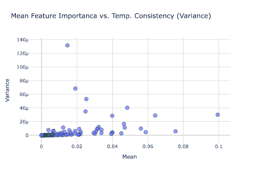

# Temp. Consistent Feature Importance

Rolling-window SHAP feature importance analysis for tree-based models.

Computes per-feature mean absolute SHAP importances across sliding time windows, enabling you to track how feature contributions evolve over time and identify temporally consistent predictors.

## Background & Motivation

### The Problem with Large Feature Sets Over Time

Gradient Boosting Machines (GBMs) are generally effective in handling multicollinearity and feature interactions, and their performance is not typically hindered by superfluous features. However, a significant concern arises when the model's dataset changes over time, particularly when substantial shifts in the default rate occur in historical data. In such cases, a large feature set can cause the model to overfit these past anomalies, thereby reducing its ability to generalize to new data.

### Limitations of Standard Feature Importance

Feature importance as is standardly available focuses on features' contribution to lowering BCE-Loss or the model output on an aggregate level for the entire training/test set:

- **Gain**: total reduction of loss or impurity contributed by all splits for a given feature.
- **Split count**: count how many times a feature is used to split.
- **Permutation**: randomly permute the values of a feature in the test set and then observe the change in the model's error.
- **Absolute sum of SHAP values**.

Model deployment necessitates careful consideration of a model's consistent contribution across various historical data time segments, a factor often overlooked by traditional metrics. Ensuring a fixed model generalizes reliably on future data is a critical concern that these metrics typically fail to address. Feature importance can be highly inconsistent over time, particularly when a feature is used to distinguish a specific time segment.

### Recap on SHAP Value Estimation

SHAP (SHapley Additive exPlanation) values decompose the model prediction into additive feature attributions. For a model $f$ with features $x_1, \dots, x_p$, the prediction for observation $i$ is additively composed of the mean model prediction $\mathbb{E}[f(x)]$ and each feature's attribution $\varphi_j$:

$$f(x_i) = \mathbb{E}[f(x)] + \varphi_1(x_i) + \varphi_2(x_i) + \cdots + \varphi_p(x_i)$$

The additive feature attributions $\varphi_j$ are given uniquely by the SHAP value (defined in [Lundberg & Lee, 2017](https://arxiv.org/pdf/1802.03888)):

$$\varphi_j = \sum_{S \subseteq \{x_1, \dots, x_p\} \setminus \{x_j\}} \frac{|S|!\;(p - |S| - 1)!}{p!} \left[ \mathbb{E}[f(x) \mid x_S \cup \{x_j\}] - \mathbb{E}[f(x) \mid x_S] \right]$$

Where $\mathbb{E}[f(x) \mid x_S]$ is the expected value of the model conditional on only the features in $S$. The SHAP value accounts for all possible coalitions of features, weighting them correctly according to their size, to produce consistent, locally accurate, and additive feature attributions.

For non-linear functions the order in which features are introduced matters. SHAP values result from averaging over all possible orderings.

The **TreeSHAP** algorithm (used by the `shap` package) intuitively calculates $\mathbb{E}[f(x) \mid x_S]$ per tree by traversing the tree from root to leaf:

- When a feature from subset $S$ is observed, traversal follows the exact decision path consistent with $x_S$.
- When missing, the expectation marginalizes over the possible splits using the sample data distribution (node cover proportions).

### Temporal Stability

Temporal stability, as we define it, quantifies the variance of a feature's importance across different time slices. We specifically analyze this by calculating feature importance on a monthly basis and then evaluating its variance.

Following model training with the provided data, we record monthly feature importance (the absolute sum of SHAP values per slice normalized by the number of observations in the slice). The implementation uses **30-day time slices moving with a 14-day increment**.

We then compute the average and variance of these importance values:

- The **mean/median** SHAP feature importance represents the feature's "contribution".
- The **variance** defines the feature's "instability".

Key observations:

- If a feature is used to distinguish a specific time segment, its attribution will be higher/lower for the relevant time slice and small otherwise — we would expect a **low mean/median with a high variance**.
- Because the TreeSHAP algorithm uses the traffic per split as observed in the sample as weights to average out features, the SHAP values should correctly be re-estimated per time slice.



## Installation

```bash
pip install consistent-feature-importance
```

For optional functionality:

```bash
# Plotting support
pip install consistent-feature-importance[plot]

# Parallel execution with Ray
pip install consistent-feature-importance[ray]
```

## Usage

```python
from consistent_feature_importance import calculate_monthly_importance, plot_feature_summary

# Compute rolling-window SHAP importances
importance_df = calculate_monthly_importance(
    estimator=model,
    df=X,
    dates=date_index,
    window_size_days=30,
    increment_size_days=14,
)

# Visualize mean importance vs. temporal variance
fig = plot_feature_summary(importance_df)
fig.show()
```

## API

### `compute_window_importance(estimator, df, features, dates, window_start, window_end, window_size_days)`

Compute mean absolute SHAP importance for a single time window. Returns a 1D numpy array or `None` if the window has insufficient rows.

### `calculate_monthly_importance(estimator, df, dates, *, window_size_days=30, increment_size_days=14, use_ray=False)`

Compute rolling-window feature importances over the full date range. Returns a DataFrame indexed by window start timestamps.

### `plot_feature_summary(df, title=None)`

Scatter plot of mean importance vs. variance across windows (requires `plotly`).

## License

MIT
